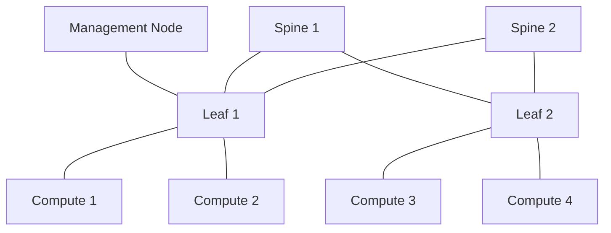

# Fabric-Faultline

## Operation Packetfall: Save the Helios AI Cluster

**A story-driven networking lab for learning networks by building, breaking, tracing, and repairing them.**

You are the new infrastructure engineer assigned to **Helios**, a small fictional AI cluster. On your first week, the network starts failing in increasingly creative ways.

Your job is not to memorize networking trivia. Your job is to answer one question over and over:

> **Where did the packet stop, and what evidence proves it?**

This lab starts from first principles and grows into a miniature AI data-center fabric using Linux network namespaces, virtual Ethernet links, Linux bridges, routing, traffic shaping, packet captures, and eventually leaf-spine concepts.

No physical switch is required. The core lab is designed to run on a single Linux machine or VM.

---

## The campaign

| Mission | Incident | Networking concept | Victory condition |
|---|---|---|---|
| 00 | **Boot Camp: Follow the Packet** | layers, interfaces, MAC, IP, TCP/UDP, ICMP | explain one packet end-to-end |
| 01 | **Two Machines, No Excuses** | interfaces, subnets, ARP/neighbor discovery | two isolated hosts can ping |
| 02 | **The Switchyard** | Ethernet, MAC learning, bridges | three hosts communicate through a virtual switch |
| 03 | **The Quarantine Deck** | VLAN concepts and segmentation | traffic is intentionally separated and restored correctly |
| 04 | **The Router at the Edge** | routing tables, gateways, IP forwarding | two subnets communicate through a router |
| 05 | **The Name That Vanished** | DNS vs connectivity | prove whether an outage is DNS or network-related |
| 06 | **The Invisible Wall** | ports, TCP/UDP, firewall reasoning | identify why ping works but an application does not |
| 07 | **The Broken Road** | latency, loss, MTU, throughput, `tc`, `iperf3` | diagnose degraded—not dead—connectivity |
| 08 | **The Fabric Awakens** | leaf-spine, ECMP concepts, east-west traffic | build and explain a miniature fabric |
| 09 | **The Training Job From Hell** | congestion, bottlenecks, AI traffic patterns | find why distributed traffic collapses under load |
| 10 | **Beyond Ethernet** | RDMA, RoCE, InfiniBand, NCCL context | explain why AI clusters use specialized networking |
| FINAL | **Black Sky Incident** | cross-layer troubleshooting | repair an unknown multi-fault scenario using evidence only |

The missions are deliberately ordered so each new concept has something concrete underneath it.

---

## The Helios network

The lab grows toward this simplified topology:



At first, most of those "machines" are Linux network namespaces rather than separate computers. That lets the entire topology live inside one laptop while still giving each simulated node its own interfaces, IP addresses, routing table, and packet path.

---

## The rule that matters most

Every incident must be investigated in this order:

```text
1. What is the expected path?
2. What is the source trying to reach?
3. Does the source have a usable interface?
4. Is the destination local or routed?
5. What does the routing table say?
6. Can the next hop be resolved?
7. Does traffic leave the interface?
8. Does traffic arrive at the next device?
9. Is the transport/application listening?
10. What changed between working and broken?
```

Do not start by randomly changing settings.

The lab rewards **evidence before fixes**.

---

## Your investigation toolkit

You will gradually learn these tools instead of trying to memorize all of them up front:

```bash
ip addr
ip link
ip route
ip neigh
ping
tracepath
ss
bridge
ethtool
tcpdump
iperf3
dig
resolvectl
nft
tc
```

For every important command, the goal is to know **which question it answers**.

Example:

```text
ip addr    → What addresses/interfaces does this host have?
ip route   → Where does the kernel intend to send this packet?
ip neigh   → Can the host map a local next-hop IP to a MAC address?
ss         → Is an application actually listening on the expected port?
tcpdump    → What packets are really crossing this interface?
```

---

## Lab philosophy

Networking often feels difficult because several independent systems are discussed at once. Fabric-Faultline separates them and then reconnects them.

Each mission has five phases:

### 1. Briefing
Understand the one new idea needed for the incident.

### 2. Build
Create a small working network.

### 3. Break
Introduce one deliberate fault.

### 4. Investigate
Use observable evidence to locate the fault before repairing it.

### 5. Debrief
Draw the packet path and explain why the failure produced the symptoms you saw.

---

## Incident report format

Every failure worth keeping gets a short incident report:

```text
Symptom:
Expected packet path:
First confirmed-good point:
First confirmed-bad point:
Evidence:
Hypothesis:
Test:
Root cause:
Fix:
Why the fix worked:
How production monitoring could detect it:
```

The finished repository should therefore demonstrate troubleshooting ability—not just working configurations.

---

## Repository structure

```text
Fabric-Faultline/
├── README.md
├── missions/
│   ├── 00-follow-the-packet.md
│   ├── 01-two-machines.md
│   ├── 02-switchyard.md
│   ├── 03-quarantine-deck.md
│   ├── 04-router-at-the-edge.md
│   ├── 05-name-that-vanished.md
│   ├── 06-invisible-wall.md
│   ├── 07-broken-road.md
│   ├── 08-fabric-awakens.md
│   ├── 09-training-job-from-hell.md
│   ├── 10-beyond-ethernet.md
│   └── final-black-sky.md
├── scripts/
│   ├── reset-lab.sh
│   └── ...
├── incidents/
├── diagrams/
├── captures/
└── notes/
```

---

## Prerequisites

Recommended environment:

- Ubuntu Server 24.04 LTS or another modern Linux distribution
- root/sudo access
- `iproute2`
- `iputils-ping`
- `tcpdump`
- `iperf3`
- `dnsutils`
- `nftables`

The early missions need very little RAM because Linux namespaces are much lighter than running a VM for every node.

---

## AI-infrastructure destination

The beginner missions teach ordinary networking first because advanced AI networking still depends on those fundamentals. Later missions connect Ethernet/IP knowledge to:

- east-west cluster traffic
- leaf-spine design
- oversubscription
- congestion
- loss and latency
- RDMA
- RoCE
- InfiniBand
- NCCL collective communication

The goal is not to pretend a laptop is an InfiniBand fabric. The goal is to understand exactly **which behaviors can be reproduced locally, which are being modeled, and why production AI clusters need specialized network designs**.

---

## Reference material

Primary references used throughout the lab:

- Ubuntu Server networking: https://documentation.ubuntu.com/server/explanation/networking/
- Ubuntu networking configuration: https://documentation.ubuntu.com/server/explanation/networking/configuring-networks/
- NVIDIA Ethernet / RoCE documentation: https://docs.nvidia.com/networking/

---

## Completion standard

Fabric-Faultline is complete when I can look at a symptom such as:

> "Compute-03 can ping its gateway, cannot reach Compute-01, DNS works, TCP retransmissions are rising, and throughput collapsed after a topology change."

…and form a disciplined troubleshooting plan instead of guessing.

**The final skill is not configuring a network. It is being able to reason about one when it is broken.**
